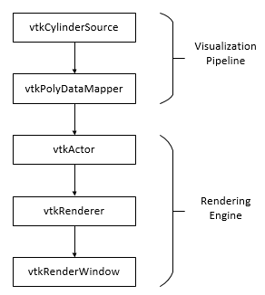
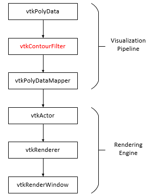

# VTK 可视化流程

## VTK 两大重要模块

每个 VTK 程序，均包含两个最重要的模块：

* 可视化管线（Visualization Pipeline）
* 渲染引擎（Rendering Engine）

其中，**可视化管线**用于获取或创建数据、加工处理数据、把数据写入文件或者把数据传递给渲染引擎，**渲染引擎**负责数据的可视化表达。

## Cylinder 程序

**说明：**本示例程序修改自 **VTK-6.1.0/Examples/Rendering/Cxx/Cylinder.cxx**。

```
#include <vtkAutoInit.h>
VTK_MODULE_INIT(vtkRenderingOpenGL)
VTK_MODULE_INIT(vtkInteractionStyle)

#include "vtkCylinderSource.h"
#include "vtkPolyDataMapper.h"
#include "vtkActor.h"
#include "vtkRenderer.h"
#include "vtkRenderWindow.h"
#include "vtkRenderWindowInteractor.h"
#include "vtkProperty.h"
#include "vtkCamera.h"
#include "vtkInteractorStyleTrackballCamera.h"

int main()
{
  // 圆柱体数据模型
  vtkCylinderSource *cylinder = vtkCylinderSource::New();
  cylinder->SetResolution(8);

  // 将几何数据转换为可被渲染引擎绘制的可视化表达
  vtkPolyDataMapper *cylinderMapper = vtkPolyDataMapper::New();
  cylinderMapper->SetInputConnection(cylinder->GetOutputPort());

  // 需要被渲染绘制的对象
  vtkActor *cylinderActor = vtkActor::New();
  cylinderActor->SetMapper(cylinderMapper);
  cylinderActor->GetProperty()->SetColor(1.0000, 0.3882, 0.2784);
  cylinderActor->RotateX(30.0);
  cylinderActor->RotateY(-45.0);

  // 渲染器 渲染窗口 交互器
  vtkRenderer *renderer = vtkRenderer::New();
  vtkRenderWindow *renWin = vtkRenderWindow::New();
  renWin->AddRenderer(renderer);
  vtkRenderWindowInteractor *iren = vtkRenderWindowInteractor::New();
  iren->SetRenderWindow(renWin);

  // 交互方式
  vtkInteractorStyleTrackballCamera *style = vtkInteractorStyleTrackballCamera::New();
  iren->SetInteractorStyle(style);

  // 将需要被渲染的对象添加到渲染器
  renderer->AddActor(cylinderActor);
  renderer->SetBackground(0.1, 0.2, 0.4);
  renWin->SetSize(200, 200);

  // 设置用于观察场景的相机
  renderer->ResetCamera();
  renderer->GetActiveCamera()->Zoom(1.5);
  renWin->Render();

  // 开始渲染 进入事件循环
  iren->Start();

  // 清除实例
  cylinder->Delete();
  cylinderMapper->Delete();
  cylinderActor->Delete();
  renderer->Delete();
  renWin->Delete();
  iren->Delete();
  style->Delete();

  return 0;
}
```



## Contour2D 程序

**说明：**本示例程序完成代码见 **_examples/Contour2D**。

```
/* 二维等值线提取与可视化代码片段 */
    // 等值线 Filter
    vtkContourFilter *contourFilter = vtkContourFilter::New();
    contourFilter->SetValue(0, ui->selectedValueLabel->text().toDouble());
    contourFilter->SetInputData(polyData);

    // 将几何数据转换为可被渲染引擎绘制的可视化表达
    vtkPolyDataMapper *contourMapper = vtkPolyDataMapper::New();
    contourMapper->SetInputConnection(contourFilter->GetOutputPort());
    contourMapper->ScalarVisibilityOff();

    // 需要被渲染绘制的对象
    contourActor = vtkActor::New();
    contourActor->SetMapper(contourMapper);
    contourActor->GetProperty()->SetColor(1.0, 0.0, 0.0);
    contourActor->GetProperty()->SetLineWidth(2.0);

    // 添加到渲染器
    renderer->AddActor(contourActor);
```



相对于 Cylinder 程序，Contour2D 主要区别在于其在增加了 ```
vtkContourFilter```
 过滤器。

在进行数据可视化时，通过在可视化管线中连接一个或多个 Filter，可以执行相关可视化算法，实现对数据的加工处理并影响最终的可视化显示。

## 参考

1. [http://blog.csdn.net/www_doling_net/article/details/8541436](http://blog.csdn.net/www_doling_net/article/details/8541436)
2. [http://lzchenheng.blog.163.com/blog/static/8383353620108130751672/](http://lzchenheng.blog.163.com/blog/static/8383353620108130751672/)
