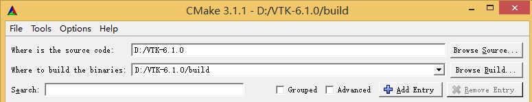
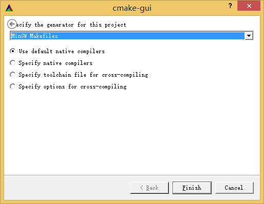
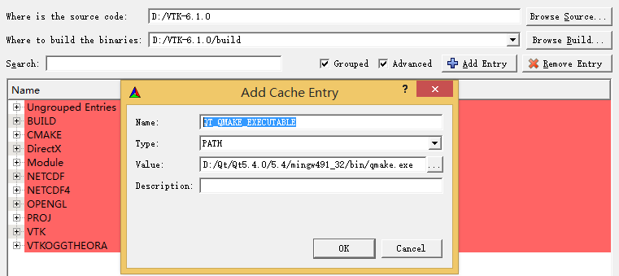
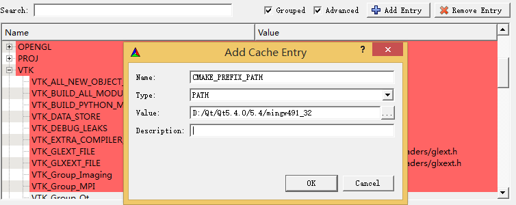
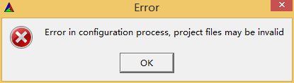
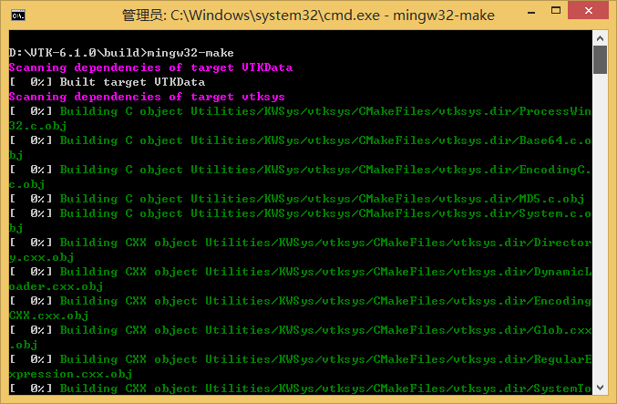

# 编译与安装

## Qt5（MinGW）使用CMake编译与使用VTK6

### 本文使用的各软件版本
* Qt：5.4.0
* MinGW：4.9.1
* CMake：3.1.1
* VTK：6.1.0

### 各软件下载地址
* Qt with MinGW：[http://www.qt.io/download-open-source/](http://www.qt.io/download-open-source/)
* CMake：[http://www.cmake.org/download/](http://www.cmake.org/download/)
* VTK：[http://vtk.org/VTK/resources/software.html](http://vtk.org/VTK/resources/software.html)

### 编译VTK
安装 Qt （安装过程中注意勾选安装MinGW）与 CMake ，并添加与 Qt 集成安装的 MinGW 可执行程序路径（ Qt\*\*\*/Tools/mingw\*\*\*/bin，即 mingw32-make.exe 所在路径）到系统环境变量 *PATH*。
解压 VTK，建议解压后路径不要包含中文与空格。

打开 VTK 目录下的 **CMakeLists.txt** 文件，在约第219行，将 *set(VTK_USE_WIN32_THREADS 1)* 修改为 *set(VTK_USE_PTHREADS 1)*，该处原始上下文为：
```
include(FindThreads)
set(VTK_USE_WIN32_THREADS 0)
set(VTK_USE_PTHREADS 0)
set(VTK_HP_PTHREADS 0)
set(VTK_USE_SPROC 0)
if(CMAKE_USE_WIN32_THREADS_INIT)
  set(VTK_USE_WIN32_THREADS 1)
  set(CMAKE_THREAD_LIBS_INIT "")
elseif(CMAKE_USE_PTHREADS_INIT)
  set(VTK_USE_PTHREADS 1)
  if(CMAKE_HP_PTHREADS_INIT)
    set(VTK_HP_PTHREADS 1)
  endif()
elseif(CMAKE_USE_SPROC_INIT)
  set(VTK_USE_SPROC 1)
endif()
```

打开 **VTK目录/ThirdParty/libxml2/vtklibxml2/threads.c**，在文件开头 *#include “libxml.h”* 后添加行： *#undef HAVE_WIN32_THREADS*，修改后上下文为：
```
#define IN_LIBXML
#include "libxml.h"
#undef HAVE_WIN32_THREADS
#include <string.h>
```

启动 CMake，并指定源代码路径和生成路径：



配置生成器为 MinGW：



点击 CMake 中的 **Configure** 进行第一次配置，配置完成后，勾选 **Search** 框后的 **Grouped** 与 **Advanced**。

在 *CMAKE* 下设置 *CMAKE_INSTALL_PREFIX* 为编译完成后 VTK 期望的安装路径，如 *D:/VTK-6.1.0/MinGW*。

在 *Module* 下勾选 *Module_vtkGUISupportQt*、 *Module_vtkGUISupportQtOpenGL*、 *Module_vtkGUISupportQtSQL*、 *Module_vtkGUISupportQtWebkit*、 *Module_vtkRenderingQt*、 *Module_vtkViewsQt*。

在 *VTK* 下勾选 *VTK_Group_Qt*。

如果需要编译为静态链接库，在 *BUILD* 下取消勾选 *BUILD_SHARED_LIBS*（如编译为静态链接库，使用时可能会遇到 lib 文件循环依赖问题）。

如果需要编译为 Release，在 *CMAKE* 下修改 *CMAKE_BUILD_TYPE* 为 *Release*。

如果需要在 Debug 模式下编译生成的库文件带 *d* 后缀，点击 **Add Entry**，手动添加后缀项， *Name* 为 *CMAKE_DEBUG_POSTFIX*， *Type* 为 *STRING*， *Value* 为 *d*。

点击 **Add Entry**，手动添加 qmake 所在路径， *Name* 为 *QT_QMAKE_EXECUTABLE*， *Type* 为 *PATH*， *Value* 为 *qmake.exe* 所在完整路径：



点击 **Add Entry**，手动添加 Qt 安装目录， *Name* 为 *CMAKE_PREFIX_PATH*， *Type* 为 *PATH*， *Value* 为 Qt 安装目录（应为包含 *qmake.exe* 的 *bin* 的父目录，可对照上下两图）：



再次点击 **Configure**。

此时将弹出错误：



在 *Ungrouped Entries* 下将 *QT_VTK_VERSION* 修改为 *5*，再次点击 **Configure**。

此时在界面下方的消息输出窗口中，将输出 *Configuring done*，点击 **Generate**。

生成完成后，将输出 *Generating done*。

在最开始在CMake中指定的生成路径中打开命令行窗口，输入 *mingw32-make*，开始编译生成：



编译完成后，执行 *mingw32-make install*，将编译生成文件输出到已配置的 *CMAKE_INSTALL_PREFIX* 目录中，此时该目录中将有 *bin*、 *include*、 *lib*、 *plugins*、 *share* 文件夹。

如果在添加了 *d* 后缀进行编译后执行 *mingw32-make install* 时，提示 *libQVTKWidgetPlugin.dll* 文件复制错误，可手动修改 **生成目录/GUISupport/Qt/PluginInstall.cmake** 文件，将其中的 *libQVTKWidgetPlugin.dll* 修改为 *libQVTKWidgetPlugind.dll*。
