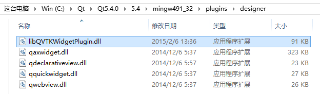
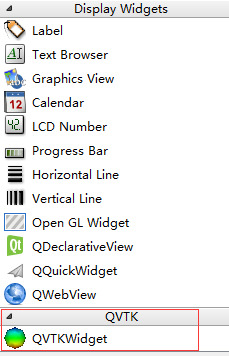

# QVTKWidget 集成

## 在 Qt Designer 中集成 QVTKWidget

在 **Release** 模式下编译完成并执行 *mingw32-make install* 后，复制 **CMAKE_INSTALL_PREFIX/plugins/designer** 目录下的 **libQVTKWidgetPlugin.dll** 到 **Qt/Qt\*\*\*/\*\*\*/mingw\*\*\*/plugins/designer** 目录（此目录应已有 **qaxwidget.dll** 等文件），打开 Qt Designer（非 QtCreator 内的 Designer，而是独立的 Qt Designer）后，即可发现增加了 *QVTK* 分类，并在其下有 *QVTKWidget* 控件。





## 在 QtCreator 中集成 QVTKWidget

如需要在 **QtCreator** 内集成的 Designer 中使用 *QVTKWidget* ，应把 **libQVTKWidgetPlugin.dll** 复制到 **Qt/Qt\*\*\*/Tools/QtCreator/bin/plugins/designer** 目录。

但由于编译生成 QtCreator 的编译器版本与生成 **libQVTKWidgetPlugin.dll** 的版本可能并不兼容，将导致无法正常加载插件。

如果无法直接使用 **libQVTKWidgetPlugin.dll** 插件，可在 Designer 中添加普通的 *QWidget* 控件后，手动将其提升为 *QVTKWidget*（对应的头文件为 **QVTKWidget.h**，注意在 **.pro** 中设置正确的 ```
INCLUDEPATH```）。

## 参考

1. [http://www.vtk.org/Wiki/VTK/Tutorials/QtSetup](http://www.vtk.org/Wiki/VTK/Tutorials/QtSetup)
